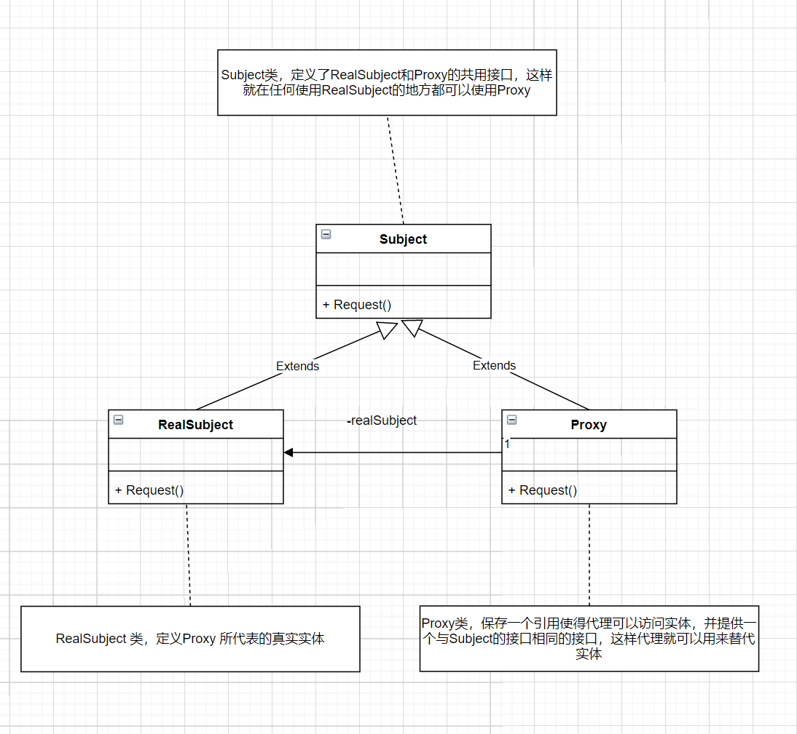

**代理模式**

为其他对象提供一种代理以控制对这个对象的访问。



```c++
#include<iostream>
using namespace std;


class Subject {
public:
    virtual void Request() = 0;
};

class RealSubject : public Subject{
public:
    virtual void Request() {
        cout << "RealSubject Request" << endl;
    }
};

class Proxy : public Subject {
private:
    RealSubject *real = nullptr;
public:
    ~Proxy() {
        if (real) {
            delete real;
        }
    }
    virtual void Request() override {
        if (!real) {
            real = new RealSubject;
        }
        real->Request();
    }
};


int main(int argc, char const *argv[])
{
    Proxy proxy;
    proxy.Request();
    return 0;
}
```

**代理模式使用场景**:

- **远程代理**: 为一个对象在不同的地址空间提供局部代表。 这样可以隐藏一个对象存在于不同地址空间的事实
- **虚拟代理**: 是根据需要创建开销很大的对象。 通过它来存放实例化需要很长时间的真实对象

比如说你打开一个很大的HTML网页时，里面可能有很多的文字和图片，但你还是可以很快打开它，此时你所看到的是所有的文字，但图片却是一张一张地下载后才能看到。那些未打开的图片框，就是通过虚拟代理来替代了真实的图片，此时代理存储了真实图片的路径和尺寸。

- **安全代理**: 用来控制真实对象访问时的权限, 一般用于对象应该有不同的访问权限的时候
- **智能指引**: 指当调用真实的对象时，代理处理另外一些事。

如计算真实对象的引用次数，这样当该对象没有引用时，可以自动释放它；或当第一次引用一个持久对象时，将它装入内存；或在访问一个实际对象前，检查是否已经锁定它，以确保其他对象不能改变它。它们都是通过代理在访问一个对象时附加一些内务处理。

