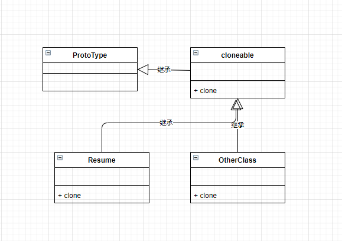

**原型模式**

用原型实例指定创建对象的种类，并且通过拷贝这些原型创建新的对象。

目前我的认知认为原型模式和拷贝构造没什么区别呀

<details>
<summary>拷贝构造函数的代码</summary>

```C++
#include<iostream>
#include<string>
using namespace std;

class Resume {
private:
    string m_name;
    int m_age;
public:
    Resume() { }
    Resume(const Resume& resume) {
        m_name = resume.m_name;
        m_age = resume.m_age;
    }

    void SetInfo(const string& name, int age) {
        m_name = name;
        m_age = age;
    }

    void display() {
        cout << "名字是: " << m_name << endl
             << "年龄是: " << m_age << endl;
    }
};

int main(int argc, char const *argv[])
{
    Resume resume;
    resume.SetInfo("杨小哥", 18);
    resume.display();

    Resume resume2 = resume;
    resume2.display();

    Resume *p = &resume;
    Resume resume3 = *p;
    resume3.display();
    return 0;
}
```

</details>



<details>
<summary>原型模式代码</summary>

```c++
#include<iostream>
#include<string>
using namespace std;
        
class ProtoType {};

class cloneable : public ProtoType {
    virtual ProtoType* clone() = 0;
};

class Resume : public cloneable {
private:
    string m_name;
    int m_age;
public:
    void SetInfo(const string &name, int age) {
        m_name = name;
        m_age = age;
    }
    void display() {
        cout << "名字是: " << m_name << endl
             << "年龄是: " << m_age << endl;
    }
    virtual Resume* clone() override {
        return new Resume(*this);
    }
};

int main(int argc, char const *argv[])
{
    Resume resume;
    resume.SetInfo("杨小哥", 18);
    resume.display();

    Resume *resume2 = resume.clone();
    resume2->SetInfo("杨小哥", 20);
    resume2->display();
    return 0;
}
```
</details>


注意，拷贝涉及到浅拷贝和深拷贝的问题，我们写代码时一定要清楚这一点。

