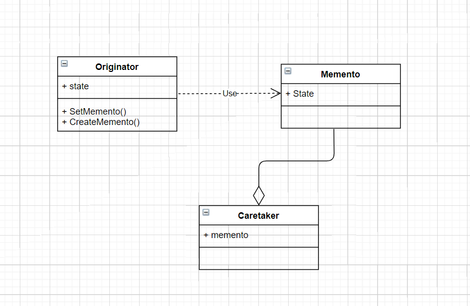

**备忘录模式**

在不破坏封装性的前提下，捕获一个对象的内部状态，并在该对象之外保存这个状态。 

这样以后就可将该对象恢复到原先保存的状态。

备忘录模式包含三个相关的类。

- originator: 发起人，需要被保存状态的源头。
- memento: 备忘录，从发起人获取状态，发起人可以根据需要决定备忘录存储哪些状态。
- caretaker: 照看人，保存备忘录，不能对备忘录的内容进行操作或检查。



<details>

<summary>备忘录模式示例代码</summary>


```C++
#include<iostream>
#include<string>
using namespace std;

class Memento {
public:
    string state;  // 需要保存的数据，可以是多个
    Memento(const string &s) : state(s) {}
};

class Originator {
private:
    string state;
public:
    Originator(const string &s) : state(s) { }

    // 创建备忘录，将需要保存的信息传入，创建一个 Memento 对象
    Memento CreateMemento() {
        return Memento(state);
    }

    // 恢复备忘录，将 Memento 导入并将相关数据恢复
    void SetMemento(const Memento &m) {
        state = m.state;
    }

    void SetState(const string &s) {
        state = s;
    }

    void Display() const {
        cout << "originator state: " << state << endl;
    }
};

class Caretaker {
public:
    Memento memnto;
    Caretaker(const Memento &m) : memnto(m) {}
};


int main(int argc, char const *argv[])
{
    Originator o("状态1");
    o.Display();

    // 备份
    Memento m = o.CreateMemento();
    Caretaker c(m);

    o.SetState("状态2");
    o.Display();

    o.SetMemento(c.memnto);
    o.Display();
    return 0;
}
```

</details>


Memento模式比较适用于功能比较复杂的，但需要维护或记录属性历史的类，或者需要保存的属性只是众多属性中的一小部分时，Originator可以根据保存的Memento信息还原到前一状态。

要保存的细节给封装在了Memento中了，哪一天要更改保存的细节也不用影响客户端。

**公众号:** *cpp_yang*

**个人微信:** *yangxg_cxy*

**今日头条:** *程序员杨小哥*

**B站:** *https://space.bilibili.com/473029051*

**知乎:** *https://www.zhihu.com/people/cpp_yang*

