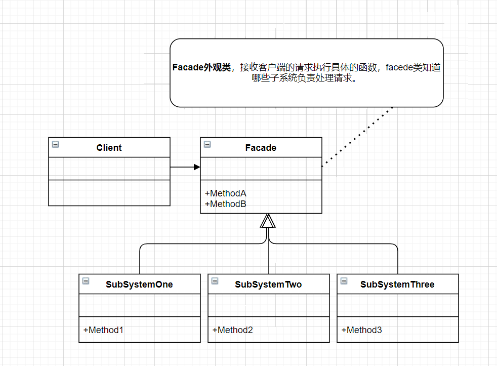

**外观模式**

为子系统中的一组接口提供一个一致的界面，此模式定义了一个高层接口，这个接口使得这一子系统更加容易使用。



<details>

<summary>外观模式示例代码</summary>

```C++
#include<iostream>
using namespace std;

class SubSystemOne {
public:
    void Method1() {
        cout << "subSystemOne Method1" << endl;
    }
};

class SubSystemTwo {
public:
    void Method2() {
        cout << "subSystemTwo Method2" << endl;
    }
};

class SubSystemThree {
public:
    void Method3() {
        cout << "subSystemThree Method3" << endl;
    }
};

class Facade {
private:
    SubSystemOne subSys1;
    SubSystemTwo subSys2;
    SubSystemThree subSys3;
public:
    void MethodA() {
        subSys1.Method1();
        subSys3.Method3();
    }

    void MethodB() {
        subSys2.Method2();
    }
};


int main(int argc, char const *argv[])
{
    Facade fac;
    fac.MethodA();
    fac.MethodB();
    return 0;
}
```

</details>

在维护一个遗留的大型系统时，可能这个系统已经非常难以维护和扩展了，但因为它包含非常重要的功能，新的需求开发必须要依赖于它。此时用外观模式Facade非常合适。你可以为新系统开发一个外观Facade类，来提供设计粗糙或高度复杂的遗留代码的比较清晰简单的接口，让新系统与Facade对象交互，Facade与遗留代码交互所有复杂的工作。

外观模式完美地体现了依赖倒转原则和迪米特法则的思想。