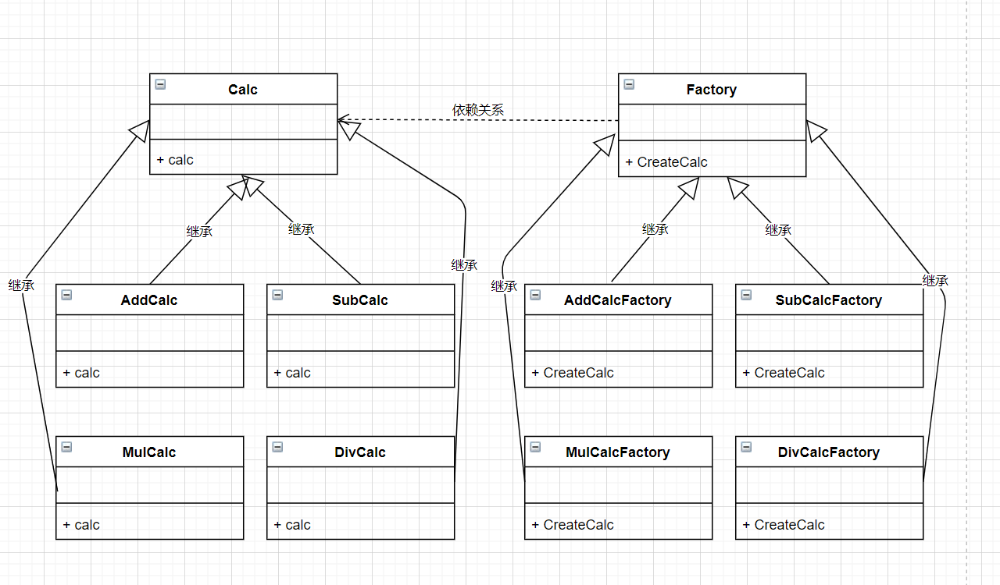

回顾简单工厂模式，在工厂类里判断到底需要创建哪一个类来计算结果，如果要加一个类的话，我们需要在工厂类里来增加一个if判断；

修改了原有的类，违背了开放封闭原则。


<details>
<summary>简单工厂模式代码</summary>

```c++
#include<iostream>
using namespace std;

class Calc {
public:
    virtual double calc(double num1, double num2) {
        return 0;
    };
};

class AddCalc : public Calc {
public:
    double calc(double num1, double num2) override {
        return num1 + num2;
    }
};

class SubCalc : public Calc {
public:
    double calc(double num1, double num2) override {
        return num1 - num2;
    }
};

class MulCalc : public Calc {
public:
    double calc(double num1, double num2) override {
        return num1 * num2;
    }
};

class DivCalc : public Calc {
public:
    double calc(double num1, double num2) override {
        if (num2 == 0) {
            cout << "除数不能为0！" << endl;
            return 0;
        }
        return num1 / num2;
    }
};

class CalcFactory {
public:
    static Calc* CreateCalc(const char op) {
        if (op == '+') {
            return new AddCalc;

        }
        else if (op == '-') {
            return new SubCalc;

        }
        else if (op == '*') {
            return new MulCalc;

        }
        else if (op == '/') {
            return new DivCalc;
        }
        else {
            throw;
        }
    }
};


int main(int argc, char const* argv[])
{
    char op;
    Calc *calc;
    double num1, num2, result;
    cout << "请输入数字A: " << endl;
    cin >> num1;

    cout << "请输入运算符(+, -, *, /):" << endl;
    cin >> op;

    cout << "请输入数字B: " << endl;
    cin >> num2;

    calc = CalcFactory::CreateCalc(op);
    result = calc->calc(num1, num2);

    cout << "两个数的运算结果为: " << result << endl;
    return 0;
}
```

</details>

下面我们将学习工厂方法模式，增加新的计算类，不需要修改原来的老代码，就能增加一个新类。



<details>
<summary>工厂方法模式代码</summary>

```c++
#include<iostream>
using namespace std;

class Calc {
public:
    virtual double calc(double num1, double num2) {
        return 0;
    };
};

class AddCalc : public Calc {
public:
    double calc(double num1, double num2) override {
        return num1 + num2;
    }
};

class SubCalc : public Calc {
public:
    double calc(double num1, double num2) override {
        return num1 - num2;
    }
};

class MulCalc : public Calc {
public:
    double calc(double num1, double num2) override {
        return num1 * num2;
    }
};

class DivCalc : public Calc {
public:
    double calc(double num1, double num2) override {
        if (num2 == 0) {
            cout << "除数不能为0！" << endl;
            return 0;
        }
        return num1 / num2;
    }
};

class CalcFactory {
public:
    virtual Calc* CreateCalc() {
        return new Calc;
    }
};

class AddCalcFactory : public CalcFactory {
public:
    virtual Calc* CreateCalc() {
        return new AddCalc;
    }
};

class SubCalcFactory : public CalcFactory {
public:
    virtual Calc* CreateCalc() {
        return new SubCalc;
    }
};

class MulCalcFactory : public CalcFactory {
public:
    virtual Calc* CreateCalc() {
        return new MulCalc;
    }
};

class DivCalcFactory : public CalcFactory {
public:
    virtual Calc* CreateCalc() {
        return new DivCalc;
    }
};


int main(int argc, char const* argv[])
{
    char op;
    Calc *calc;
    double num1, num2, result;
    cout << "请输入数字A: " << endl;
    cin >> num1;

    cout << "请输入运算符(+, -, *, /):" << endl;
    cin >> op;

    cout << "请输入数字B: " << endl;
    cin >> num2;

    CalcFactory *factory;
    if (op == '+') {
        factory = new AddCalcFactory;

    }
    else if (op == '-') {
        factory = new SubCalcFactory;

    }
    else if (op == '*') {
        factory = new MulCalcFactory;

    }
    else if (op == '/') {
        factory = new DivCalcFactory;
    }
    else {
        throw;
    }

    calc = factory->CreateCalc();
    result = calc->calc(num1, num2);
    cout << "两个数的运算结果为: " << result << endl;
    return 0;
}
```

</details>

最重要的一点就是把判断运算符的逻辑从设计里挪到了调用的地方，从而在新增运算符时可以不用动原来写好的类，遵循了开放关闭原则。

**工厂方法模式**

定义一个用于创建对象的接口，让子类决定实例化哪一个类，工厂方法使一个类的实例化延迟到子类。


