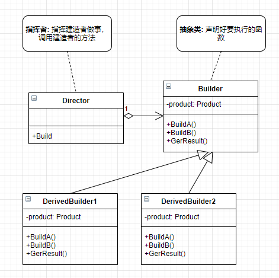

**建造者模式**

将一个复杂的对象构建与它的表示分离，使得同样的构建过程可以创建不同的表示。

建造者模式可以将一个产品的内部表象与产品的生成过程分割开来，从而可以使一个建造过程生成具有不同的内部表象的产品对象。

如果我们用了建造者模式，那么用户就只需指定需要建造的类型就可以得到它们，而具体建造的过程和细节就不需知道了。”

几个类的说明:

- Director: 指挥者，指挥不同的建造者。
- Builder: 建造者抽象类，定义构建产品所需要的抽象接口。
- 具体的建造者: 实现抽象接口。
- Product: 产品，具体的建造者为产品构建产品的每一部分。

***为什么要有 Director ?***

通过指挥者指挥建造者，建造者需要调用什么方法，调用的人可以忽略，不必知道。




建造者模式主要是用于创建一些复杂的对象，这些对象内部构建间的建造顺序通常是稳定的，但对象内部的构建通常面临着复杂的变化。

建造者模式的好处就是使得建造代码与表示代码分离，由于建造者隐藏了该产品是如何组装的，所以若需要改变一个产品的内部表示，只需要再定义一个具体的建造者就可以了。

<details>

<summary>建造者模式实例代码</summary>

```C++
#include<iostream>
#include<vector>
using namespace std;

class Product {
private:
    vector<string> parts;
public:
    void Add(const string &str) {
        parts.push_back(str);
    }
    void Show() const {
        cout << "Show =============>" << endl;
        for (auto part : parts) {
            cout << part << endl;
        }
    }
};

class Builder {
protected:
    Product product;
public:
    virtual void BuildA() = 0;
    virtual void BuildB() = 0;
    virtual Product GetResult() const = 0;
};

class Director {
public:
    void Build(Builder &build) {
        build.BuildA();
        build.BuildB();
    }
};

class DerivedBuilder1 : public Builder {
public:
    virtual void BuildA() {
        product.Add("DerivedBuilder1 BuildA");
    }
    virtual void BuildB() {
        product.Add("DerivedBuilder1 BuildB");
    }
    virtual Product GetResult() const override {
        return product;
    }
};

class DerivedBuilder2 : public Builder {
public:
    virtual void BuildA() {
        product.Add("DerivedBuilder2 BuildA");
    }
    virtual void BuildB() {
        product.Add("DerivedBuilder2 BuildB");
    }
    virtual Product GetResult() const override {
        return product;
    }
};

int main(int argc, char const *argv[])
{
    DerivedBuilder1 build1;
    DerivedBuilder2 build2;

    Director director;

    director.Build(build1);
    Product p1 = build1.GetResult();
    p1.Show();

    director.Build(build2);
    Product p2 = build2.GetResult();
    p2.Show();
    return 0;
}
```

</details>