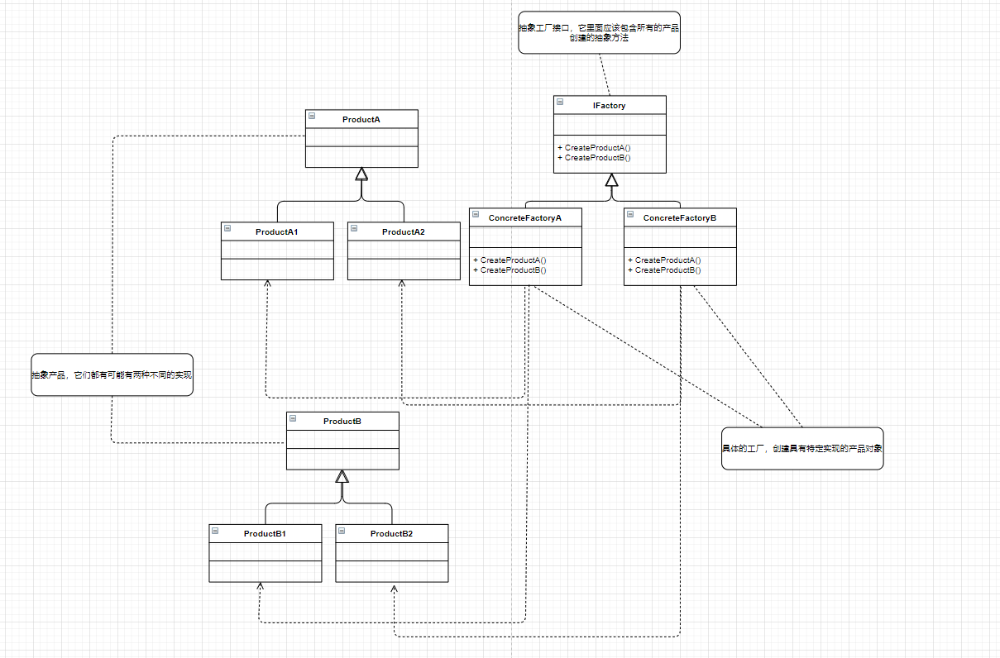

**抽象工厂模式**

提供一个创建一系列相关或相互依赖对象的接口，而无需指定它们具体的类。



ProductA和ProductB是两个抽象产品，之所以为抽象，是因为它们都有可能有两种不同的实现

而ProductA1、ProductA2和ProductB1、ProductB2就是对两个抽象产品的具体分类的实现

IFactory是一个抽象工厂接口，它里面应该包含所有的产品创建的抽象方法。而ConcreteFactoryA和ConcreteFactoryB就是具体的工厂

通常是在运行时刻再创建一个ConcreteFactory类的实例，这个具体的工厂再创建具有特定实现的产品对象，也就是说，为创建不同的产品对象，客户端应使用不同的具体工厂。

```C++
#include<iostream>
using namespace std;

class Product {
public:
    virtual void Show() const = 0;
};

class ProductA1 : public Product {
public:
    virtual void Show() const override {
        cout << "ProductA1" << endl;
    }
};

class ProductA2 : public Product {
public:
    virtual void Show() const override {
        cout << "ProductA2" << endl;
    }
};

class ProductB1 : public Product {
public:
    virtual void Show() const override {
        cout << "ProductB1" << endl;
    }
};

class ProductB2 : public Product {
public:
    virtual void Show() const override {
        cout << "ProductB2" << endl;
    }
};

class IFactory {
public:
    virtual Product* CreateProductA() = 0;
    virtual Product* CreateProductB() = 0;
};

class ConcreteFactoryA : public IFactory {
public:
    virtual Product* CreateProductA() override {
        return new ProductA1;
    }
    virtual Product* CreateProductB() override {
        return new ProductB1;
    }
};

class ConcreteFactoryB : public IFactory {
public:
    virtual Product* CreateProductA() override {
        return new ProductA2;
    }
    virtual Product* CreateProductB() override {
        return new ProductB2;
    }
};

int main(int argc, char const *argv[])
{
    ConcreteFactoryA fa;
    Product *a1 = fa.CreateProductA();
    Product *b1 = fa.CreateProductB();
    a1->Show();
    b1->Show();
    delete a1;
    delete b1;

    ConcreteFactoryB fb;
    Product *a2 = fb.CreateProductA();
    Product *b2 = fb.CreateProductB();
    a2->Show();
    b2->Show();
    delete a2;
    delete b2;
    return 0;
}
```


