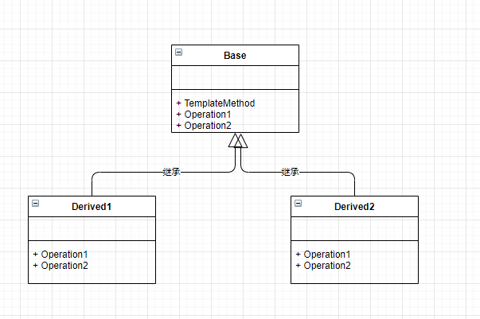

**模板方法模式**

定义一个操作中的算法的骨架，而将一些步骤延迟到子类中。

模板方法使得子类可以不改变一个算法的结构即可重定义该算法的某些特殊步骤。

------------------------

模板方法模式通过把不变行为搬移到父类，父类保证统一的算法骨架，具体的算法实现放在子类中。



<details>
<summary>模板方法模式代码</summary>

```c++
#include<iostream>
using namespace std;

class Base {
public:
    virtual void Operation1() = 0;  
    virtual void Operation2() = 0;
    void TemplateMethod() {
        Operation1();
        Operation2();
    }
};

class Derived1 : public Base {
public:
    virtual void Operation1() override {
        cout << "Derived1 Operation1" << endl;
    }
    virtual void Operation2() override {
        cout << "Derived1 Operation2" << endl;
    }
};

class Derived2 : public Base {
public:
    virtual void Operation1() override {
        cout << "Derived2 Operation1" << endl;
    }
    virtual void Operation2() override {
        cout << "Derived2 Operation2" << endl;
    }
};


int main(int argc, char const *argv[])
{
    Derived1 d1;
    d1.TemplateMethod();

    Derived2 d2;
    d2.TemplateMethod();
    return 0;
}
```

</details>


