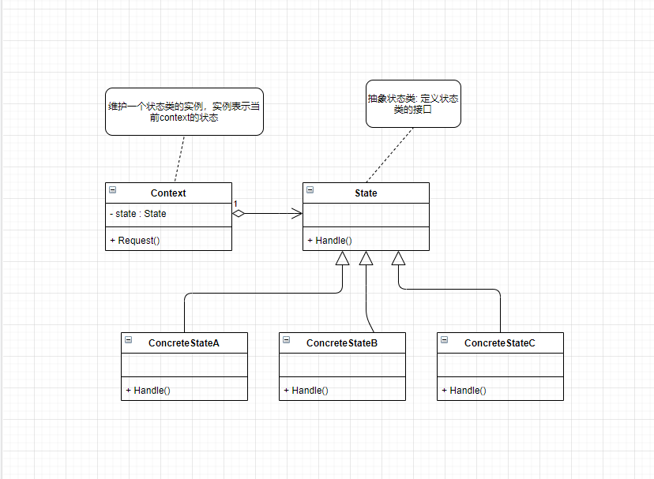

**状态模式**

当一个对象的内在状态改变时允许改变其行为，这个对象看起来像是改变了其类。

状态模式主要解决的是当控制一个对象状态转换的条件表达式过于复杂时的情况。

把状态的判断逻辑转移到表示不同状态的一系列类当中，可以把复杂的判断逻辑简化。



<details>

<summary>状态模式示例代码</summary>

```C++
#include<iostream>
using namespace std;

class Context;

class State {
public:
    virtual void Handle(Context* ctx) = 0;
    virtual ~State() {}
};

class ConcreteStateA : public State {
public:
    virtual void Handle(Context* ctx) override;
};

class ConcreteStateB : public State {
public:
    virtual void Handle(Context* ctx) override;
};

class ConcreteStateC : public State {
public:
    virtual void Handle(Context* ctx) override;
};

class ConcreteStateD : public State {
public:
    virtual void Handle(Context* ctx) override;
};

class Context {
public:
    State* state;
    Context(State *s) {
        state = s;
    }
    ~Context() {
        if (state) {
            delete state;
        }
    }
    void Request();
};

void Context::Request() {
    state->Handle(this);
}

void ConcreteStateA::Handle(Context *ctx) {
    cout << "state A handle" << endl;
    ctx->state = new ConcreteStateB;
}

void ConcreteStateB::Handle(Context *ctx) {
    cout << "state B handle" << endl;
    ctx->state = new ConcreteStateC;
}

void ConcreteStateC::Handle(Context *ctx) {
    cout << "state C handle" << endl;
    ctx->state = new ConcreteStateD;    
}

void ConcreteStateD::Handle(Context *ctx) {
    cout << "state D handle" << endl;
}


int main(int argc, char const* argv[])
{
	ConcreteStateA s;
    Context ctx(&s);
    ctx.Request();
    ctx.Request();
    ctx.Request();
    ctx.Request();
    return 0;
}
```

</details>


将特定的状态相关的行为都放入一个对象中，由于所有与状态相关的代码都存在于某个ConcreteState中，所以通过定义新的子类可以很容易地增加新的状态和转换

消除庞大的条件分支语句，大的分支判断会使得它们难以修改和扩展。

状态模式通过把各种状态转移逻辑分布到State的子类之间，来减少相互间的依赖

**什么时候考虑使用状态模式?**

当一个对象的行为取决于它的状态，并且它必须在运行时刻根据状态改变它的行为时，就可以考虑使用状态模式了


**公众号:** *cpp_yang*

**个人微信:** *yangxg_cxy*

**今日头条:** *程序员杨小哥*

**B站:** *https://space.bilibili.com/473029051*

**知乎:** *https://www.zhihu.com/people/cpp_yang*


