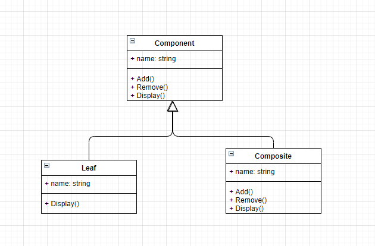

**组合模式**

将对象组合成树形结构以表示“部分-整体”的层次结构。

组合模式使得用户对单个对象和组合对象的使用具有一致性。




<details>
<summary>组合模式代码</summary>

```C++
#include<iostream>
#include<string>
#include<vector>
using namespace std;

class Component {
private:
    string name;
    vector<Component*> vec;
public:
    Component(const string &name) : name(name) {}
    ~Component() {
        for (Component *p : vec) {
            if (p) {
                delete p;
            }
        }
    }
    virtual void Add(Component *c) {
        vec.push_back(c);
    }
    virtual void Remove(Component *c) {
        for (auto iter = vec.begin(); iter != vec.end(); ++iter) {
            if (*iter == c) {
                vec.erase(iter);
            }
        }
    }
    void Display(int depth) const {
        cout << string(depth, '-') << name << endl;
        for (Component *c : vec) {
            c->Display(depth + 2);
        }
    }
    virtual void Work() const {
        cout << name << " work!" << endl;
        for (Component *c : vec) {
            c->Work();
        }
    }
};

class Composite : public Component {
public:
    Composite(const string& name) : Component(name) {}
    ~Composite() {}
};

class Leaf : public Component {
public:
    Leaf(const string& name) : Component(name) {}
    ~Leaf() {}
    void Add(Component *c) override {
        cout << "Leaf cannot Add!" << endl;
    }
    void Remove(Component *c) override {
        cout << "Leaf cannot Remove!" << endl;
    }
};


int main(int argc, char const *argv[])
{
    Composite root("root");
    Composite *compX = new Composite("composite x");
    Composite *compY = new Composite("composite y");
    root.Add(compX);
    root.Add(compY);

    Leaf *leafXX = new Leaf("leaf xx");
    Leaf *leafXY = new Leaf("leaf xy");
    compX->Add(leafXX);
    compX->Add(leafXY);

    Leaf *leafYX = new Leaf("leaf yx");
    Leaf *leafYY = new Leaf("leaf yy");
    compY->Add(leafYX);
    compY->Add(leafYY);

    root.Display(1);
    root.Work();
    return 0;
}
```

</details>

***透明方式与安全方式***

**透明方式**: Component 中声明所有用来管理子对象的方法，其中包括Add，Remove 等。

这样实现Component接口的所有子类都具备了Add 和 Remove。 

这样做的好处就是叶节点和枝直接对于外界没有区别，它们具备完全一致的行为接口。

但问题也很明显，因为Leaf类本身不具备Add（）、Remove（）方法的功能，所以实现它是没有意义的。

**安全方式**: 也就是在Component接口中不去声明Add和Remove方法，那么子类的Leaf也就不需要去实现它，而是在Composite声明所有用来管理子类对象的方法, 不过由于不够透明，所以树叶和树枝类将不具有相同的接口，客户端的调用需要做相应的判断，带来了不便。


***何时使用组合模式***

当你发现需求中是体现部分与整体层次的结构时，以及你希望用户可以忽略组合对象与单个对象的不同，统一地使用组合结构中的所有对象时，就应该考虑用组合模式了。


**公众号:** *cpp_yang*

**个人微信:** *yangxg_cxy*

**今日头条:** *程序员杨小哥*

**B站:** *https://space.bilibili.com/473029051*

**知乎:** *https://www.zhihu.com/people/cpp_yang*


