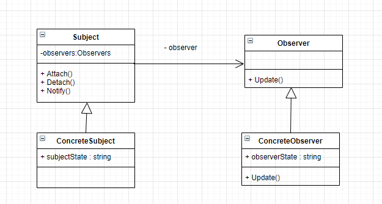

**观察者模式**

定义了一种一对多的依赖关系，让多个观察者对象同时监听某一个主题对象。

这个主题对象在状态发生变化时，会通知所有观察者对象，使它们能够自动更新自己。

***什么时候使用观察者模式***

当一个对象的改变需要同时改变其他对象的时候，而且它不知道具体有多少对象有待改变时，应该考虑使用观察者模式。

观察者模式所做的工作其实就是在解除耦合。让耦合的双方都依赖于抽象，而不是依赖于具体。从而使得各自的变化都不会影响另一边的变化。


***观察者模式的不足***

如果其他人事先写好的类，如何再去实现 Observer 的Update 接口呢？



<details>

<summary>观察者模式示例代码</summary>

```C++
#include<iostream>
#include<string>
#include<vector>
using namespace std;

class BaseObserver {
public:
    string state;
    string m_name;
    virtual void Update(const string& n, const string& st) = 0;
};

class BaseSubject {
public:
    vector<BaseObserver*> observers;
    string subState;
    string m_name;
    virtual void Attach(BaseObserver*) = 0;
    virtual void Detach(BaseObserver*) = 0;
    virtual void Notify() = 0;
};

class SubjectA : public BaseSubject {
public:
    SubjectA(const string& name) {
        m_name = name;
    };

    virtual void Attach(BaseObserver* ob) override {
        observers.push_back(ob);
    }

    virtual void Detach(BaseObserver* ob) override {
        for (auto iter = observers.begin(); iter != observers.end();) {
            if (*iter == ob) {
                iter = observers.erase(iter);
            }
            else {
                ++iter;
            }
        }
    }

    virtual void Notify() override {
        for (auto p : observers) {
            p->Update(m_name, subState);
        }
    }
};

class Observer : public BaseObserver {
public:
    Observer(const string& name) {
        m_name = name;
    };
    virtual void Update(const string& n, const string& st) override {
        state = st;
        cout << "selfNmae: " << m_name
            << " state: " << state
            << " event name: " << n
            << endl;
    }
};

int main(int argc, char const* argv[])
{
    Observer ob1("ob1");
    Observer ob2("ob2");
    SubjectA sub("subjectA");

    sub.Attach(&ob1);
    sub.Attach(&ob2);
    sub.Detach(&ob1);
    sub.subState = "状态改变了";
    sub.Notify();
    return 0;
}
```

</details>

**公众号:** *cpp_yang*

**个人微信:** *yangxg_cxy*

**今日头条:** *程序员杨小哥*

**B站:** *https://space.bilibili.com/473029051*

**知乎:** *https://www.zhihu.com/people/cpp_yang*

  
  
  