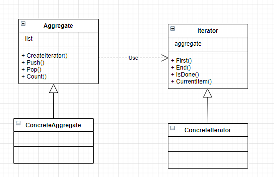

**迭代器模式**

提供一种方法顺序的访问一个聚合对象的内部元素，而又不暴露该对象的内部表示。



```C++
#include<iostream>
#include<vector>
using namespace std;

class Iterator {
public:
    virtual int First() const = 0;
    virtual int End() const = 0;
    virtual bool IsDone() const = 0;
    virtual bool Next() = 0;
    virtual int CurrentItem() const = 0;
};

class Aggregate {
public:
    virtual Iterator* CreateIterator() const = 0;
    virtual int Count() const = 0;
    virtual void Push(int value) = 0;
    virtual int Pop(int index) const = 0;
};

class ConcreteIterator : public Iterator {
private:
    const Aggregate* aggregate;
    int count;
    int currentIndex;
public:
    explicit ConcreteIterator(const Aggregate* aggregate) : aggregate(aggregate) {
        count = aggregate->Count();
        currentIndex = 0;
    }

    ~ConcreteIterator() {
        if (aggregate) {
            delete aggregate;
        }
    }

    int First() const override {
        return aggregate->Pop(0);
    }
    int End() const override {
        return aggregate->Pop(count - 1);
    }
    bool IsDone() const override {
        return currentIndex == count ? true : false;
    }
    bool Next() override {
        if (!IsDone()) {
            ++currentIndex;
            return true;
        }
        return false;
    }
    int CurrentItem() const override {
        int p;
        if (!IsDone()) {
            p = aggregate->Pop(currentIndex);
        }
        return p;
    }
};

class ConcreteAggregate : public Aggregate {
private:
    vector<int> vec;
public:
    Iterator* CreateIterator() const override {
        return new ConcreteIterator(this);
    }
    int Count() const override {
        return vec.size();
    }
    void Push(int value) override {
        vec.push_back(value);
    }

    int Pop(int index) const override {
        return vec[index];
    }
};


int main(int argc, char const* argv[])
{
    ConcreteAggregate aggregate;
    aggregate.Push(1);
    aggregate.Push(2);
    aggregate.Push(3);

    Iterator *iter = aggregate.CreateIterator();
    while (!iter->IsDone())
    {
        cout << iter->CurrentItem() << endl;
        iter->Next();
    }

    cout << "first: " << iter->First() << endl;
    cout << "end: " << iter->End() << endl;
    delete iter;
    return 0;
}
```

- Iterator： 迭代器抽象类，用于定义得到开始对象，得到下一个对象，判断是否到结尾，当前对象等抽象方法，统一接口。
- Aggregate: 聚集抽象类，统一接口。
- ConcreteIterator: 具体的抽象类，可以实现不同的迭代方式
- ConcreteAggregate: 具体的聚集类，实现数据元素的保存，以及接口的统一

***什么时候使用迭代器模式？***

需要对聚集有多种方式遍历时，可以考虑用迭代器模式

迭代器（Iterator）模式就是分离了集合对象的遍历行为，抽象出一个迭代器类来负责，这样既可以做到不暴露集合的内部结构，又可让外部代码透明地访问集合内部的数据。

不过现在的高级语言一般都继承了迭代器，实际上需要迭代器模式的场景不多。