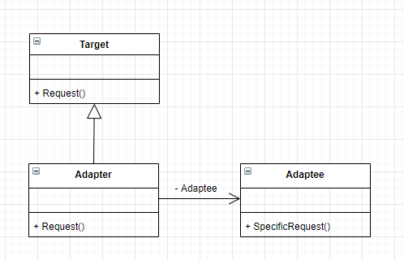

**适配器模式**

将一个类的接口转换成客户希望的另外一个接口，Adapter 模式使得原本由于接口不兼容而不能一起工作的那些类可以一起工作。

***适配器模式主要解决什么问题呢？***

简单地说，就是需要的东西就在面前，但却不能使用，而短时间又无法改造它，于是我们就想办法适配它。

其实这个词应该是最早出现在电工学里，有些国家用110 V电压，而我们国家用的是220 V，但我们的电器，比如笔记本电脑是不能什么电压都能用的，但国家不同，电压可能不相同也是事实，于是就用一个电源适配器，只要是电，不管多少伏，都能把电源变成需要的电压，这就是电源适配器的作用。


--------------------



系统的数据和行为都正确，但接口不符时，我们应该考虑用适配器，目的是使控制范围之外的一个原有对象与某个接口匹配。适配器模式主要应用于希望复用一些现存的类，但是接口又与复用环境要求不一致的情况，比如在需要对早期代码复用一些功能等应用上很有实际价值。

<details>

<summary>适配器模式代码示例</summary>

```C++
#include<iostream>
using namespace std;


class Target {
public:
    virtual ~Target() {}
    virtual void Request() = 0;
};

class Adaptee {
public:
    void SpecificRequest() const {
        cout << "Adaptee SpecificRequest" << endl;
    }
};

class Adapter : public Target {
private:
    Adaptee *ade = nullptr;
public:
    Adapter() {
        ade = new Adaptee;
    }
    ~Adapter() {
        if (ade) {
            delete ade;
        }
    }
    virtual void Request() override {
        ade->SpecificRequest();
    }
};

int main(int argc, char const* argv[])
{
    Target* tar = new Adapter();
    tar->Request();
    delete tar;
    return 0;
}
```

</details>

***何时使用适配器模式***

- 使用一个已经存在的类，但如果它的接口，也就是它的方法和你的要求不相同时，就应该考虑用适配器模式
- 两个类所做的事情相同或相似，但是具有不同的接口时要使用它
- 公司设计一系统时考虑使用第三方开发组件，而这个组件的接口与我们自己的系统接口是不相同的，而我们也完全没有必要为了迎合它而改动自己的接口，此时尽管是在开发的设计阶段，也是可以考虑用适配器模式来解决接口不同的问题。
